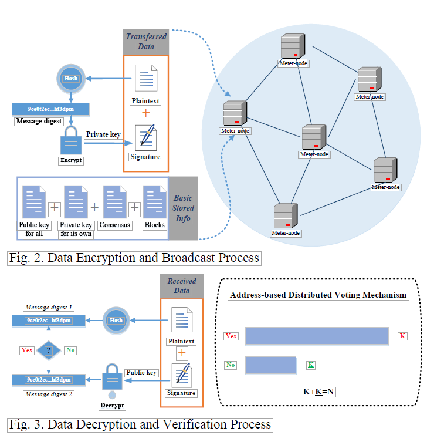

# 论文阅读笔记

## 论文基本信息

- 笔记作者：方钰舟
- 原文作者：Gaoqi Liang, Member, IEEE, Steven R. Weller, Member, IEEE, Fengji Luo, Member, IEEE,
  Junhua Zhao, Senior Member, IEEE, and Zhao Yang Dong, Fellow, IEEE
- 原文题目：Distributed Blockchain-Based Data Protection Framework for Modern Power Systems against Cyber Attacks
- 原文期刊: IEEE Transactions on Smart Grid

## 主要内容总结

​	随着智能电网的不断发展，智能电网的网络安全也日益受到威胁。这篇文章提出了一个新的，基于分布式区块链的保护框架，以增强现代电力系统抵御网络攻击的自防御能力。其通过将电表用作将电表测量值封装为块的分布式网络中的节点，全面讨论如何使用区块链技术来增强电网的鲁棒性和安全性。 通过在IEEE-118基准系统上的仿真实验证明了所提出的保护框架的有效性。

​	虚假数据注入攻击是比较具有代表性的网络攻击。为了防范注入虚假数据注入攻击以及DDOS等其他方式的网络攻击，这篇文章提出了提出了一种基于区块链的分布式数据保护框架，做出了包含以下几点的贡献：

1. 该框架大大增强了现代电力系统针对网络攻击者进行数据操纵的自我防御能力。
2. 基于共识并利用了电网环境的特定特征提出了框架。

​	该框架使用重新配置的SCADA网络来收集，传输和存储数据。在重新配置的SCADA网络中，数据采集模块仍从电网收集实时测量值，包括电压，电流，有功和无功功率流量，断路器状态，变压器抽头位置等。在这个框架中，所有收集的数据最终都以连接块的形式存储以分布式形式在于每个电表的内存中。 在存储之前，必须执行以下每个过程以确保数据的准确性。分布式区块链网络中的数据的传输和广播以及加密的过程可以如下图所示，其中加密的过程中主要是用了SHA1算法。然后该框架还规定了每一个结点的共识机制来保护数据的完整性。最终通过借助区块链的思想与方法，该框架实现了保护智能网络节点中数据不被任意篡改，防范假数据攻击的目的

## 缺点

1. 及时性。该框架是一个几乎全新于现有的智能电网系统，没有 在现有的电网系统上进行改进，完全替代现有的智能电网系统基础设施成本过高。
2. 安全性。该框架的安全性有待进一步的提升，容易遭受恶意软件或者病毒等攻击，使得区块链认证机制失效。
3. 数据冗余性。该框架在每个单独的智能电网结点上保存有较为冗余但是却又是必要的配置信息，容易造成敏感信息泄露给攻击者提供攻击的方式。

## 改进方案

​	区块链技术在智能电网中的应用可以说是一个比较不错的创新，智能电网在某种程度上来说也可以被看做也较为独立的一组计算机网络。该框架借鉴区块链技术保护了智能电网中数据的CIA三特性，但同时由于是完全架空在现有的智能电网的架构之上重新设计的框架，所以导致其更新成本过高，没有办法立刻实现应用在实际电网系统之中。因此，我认为可以从现有的智能电网系统入手，着手进行改进，逐步加入区块链等认证机制等，当然如果这样做会比重新设计一个框架更加的复杂，但这也是在现有条件下，对智能电网系统改造相比较重新设计一个智能电网系统框架是更加现实可行的。

